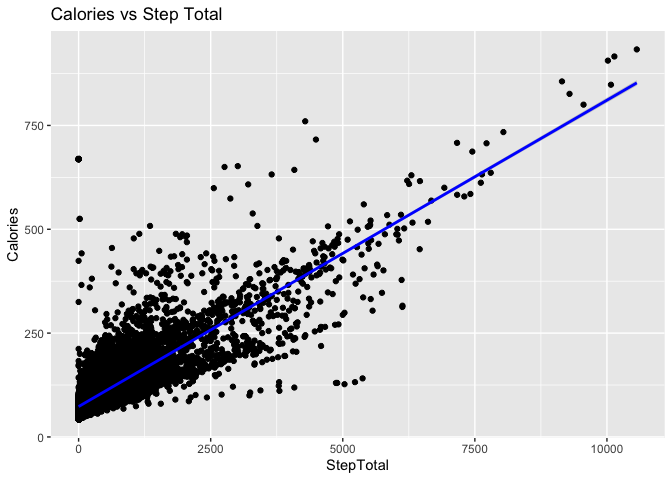

Bellabeat\_Analysis
================
Nicole Pierre
10/13/2025

## Business Task

Analyze data collected from a competitor’s products to uncover trends,
insights, and recommendations to present to stakeholders.

## Questions Our Analysis Should Answer

  - What are some trends in smart device usage?
  - How could these trends apply to Bellabeat customers?
  - How could these trends help influence Bellabeat marketing
    strategies?

## Loading Necessary Packages

``` r
library(tidyverse)
```

    ## Warning: package 'tidyverse' was built under R version 3.6.2

    ## ── Attaching packages ─────────────────────────────────────── tidyverse 1.3.1 ──

    ## ✓ ggplot2 3.3.5     ✓ purrr   0.3.4
    ## ✓ tibble  3.1.2     ✓ dplyr   1.0.7
    ## ✓ tidyr   1.1.3     ✓ stringr 1.4.0
    ## ✓ readr   1.4.0     ✓ forcats 0.5.1

    ## Warning: package 'tibble' was built under R version 3.6.2

    ## Warning: package 'tidyr' was built under R version 3.6.2

    ## Warning: package 'readr' was built under R version 3.6.2

    ## Warning: package 'purrr' was built under R version 3.6.2

    ## Warning: package 'dplyr' was built under R version 3.6.2

    ## Warning: package 'forcats' was built under R version 3.6.2

    ## ── Conflicts ────────────────────────────────────────── tidyverse_conflicts() ──
    ## x dplyr::filter() masks stats::filter()
    ## x dplyr::lag()    masks stats::lag()

``` r
library(lubridate)
```

    ## Warning: package 'lubridate' was built under R version 3.6.2

    ## 
    ## Attaching package: 'lubridate'

    ## The following objects are masked from 'package:base':
    ## 
    ##     date, intersect, setdiff, union

``` r
library(dplyr)
```

## The Data

The data used for this analysis was collected from fitbit users and can
be found [here](https://www.kaggle.com/datasets/arashnic/fitbit/data).

## Cleaning the Datasets

First, lets load the datasets into
R.

``` r
activity <- read.csv("/Users/nicolebroussard/Documents/Google_DA_Cert /Case Study/Bellabeat-Fitbit-Analysis-R/Data/dailyActivity_merged.csv")
calories <- read.csv("/Users/nicolebroussard/Documents/Google_DA_Cert /Case Study/Bellabeat-Fitbit-Analysis-R/Data/hourlyCalories_merged.csv")
heartrate <- read.csv("/Users/nicolebroussard/Documents/Google_DA_Cert /Case Study/Bellabeat-Fitbit-Analysis-R/Data/heartrate_seconds_merged.csv")
intensities <- read_csv("/Users/nicolebroussard/Documents/Google_DA_Cert /Case Study/Bellabeat-Fitbit-Analysis-R/Data/hourlyIntensities_merged.csv")
```

    ## 
    ## ── Column specification ────────────────────────────────────────────────────────
    ## cols(
    ##   Id = col_double(),
    ##   ActivityHour = col_character(),
    ##   TotalIntensity = col_double(),
    ##   AverageIntensity = col_double()
    ## )

``` r
steps <- read_csv("/Users/nicolebroussard/Documents/Google_DA_Cert /Case Study/Bellabeat-Fitbit-Analysis-R/Data/hourlySteps_merged.csv")
```

    ## 
    ## ── Column specification ────────────────────────────────────────────────────────
    ## cols(
    ##   Id = col_double(),
    ##   ActivityHour = col_character(),
    ##   StepTotal = col_double()
    ## )

# Fix Data Types

After viewing the data sets, the date column data types are incorrect.
The date columns should be a datetime string. While changing the data
type I will be splitting the date and time into two different columns
for analysis.

``` r
#activity
activity$ActivityDate <- as.POSIXct(activity$ActivityDate, format = "%m/%d/%Y", tz = "GMT")
activity$Date <- format(activity$ActivityDate, "%m/%d/%y")
#calories
calories$ActivityHour <- as.POSIXct(calories$ActivityHour, format = "%m/%d/%Y %I:%M:%S %p", tz = "GMT")
calories$Date <- format(calories$ActivityHour, format = "%m/%d/%y")
calories$Time <- format(calories$ActivityHour, format = "%H:%M:%S")
#heartrate
heartrate$Time <- as.POSIXct(heartrate$Time, format = "%m/%d/%Y %I:%M:%S %p", tz = "GMT")
heartrate$Date <- format(heartrate$Time, "%m/%d/%y")
heartrate$Time2 <- format(heartrate$Time, "%H:%M:%S")
#intensities
intensities$ActivityHour <- as.POSIXct(intensities$ActivityHour, format= "%m/%d/%Y %I:%M:%S %p", tz = "GMT")
intensities$Date <- format(intensities$ActivityHour, "%m/%d/%y")
intensities$Time <- format(intensities$ActivityHour, "%H:%M:%S")
#steps
steps$ActivityHour <- as.POSIXct(steps$ActivityHour, format = "%m/%d/%Y %I:%M:%S %p", tz = "GMT")
```

``` r
steps$Date <- format(steps$ActivityHour, "%m/%d/%y")
steps$Time <- format(steps$ActivityHour, "%H:%M:%S")
```

# Search for NA Values

Now let’s search for NA values that could cause issues during our
analysis.

``` r
colSums(is.na(activity))
```

    ##                       Id             ActivityDate               TotalSteps 
    ##                        0                        0                        0 
    ##            TotalDistance          TrackerDistance LoggedActivitiesDistance 
    ##                        0                        0                        0 
    ##       VeryActiveDistance ModeratelyActiveDistance      LightActiveDistance 
    ##                        0                        0                        0 
    ##  SedentaryActiveDistance        VeryActiveMinutes      FairlyActiveMinutes 
    ##                        0                        0                        0 
    ##     LightlyActiveMinutes         SedentaryMinutes                 Calories 
    ##                        0                        0                        0 
    ##                     Date 
    ##                        0

``` r
colSums(is.na(calories))
```

    ##           Id ActivityHour     Calories         Date         Time 
    ##            0            0            0            0            0

``` r
colSums(is.na(heartrate))
```

    ##    Id  Time Value  Date Time2 
    ##     0     0     0     0     0

``` r
sum(is.na(intensities))
```

    ## [1] 0

``` r
sum(is.na(steps))
```

    ## [1] 0

# Summarize the Data

Now that the data is clean, I will use the summarize function to gather
some insights into the columns in each data
    set.

``` r
summary(activity)
```

    ##        Id             ActivityDate                   TotalSteps   
    ##  Min.   :1.504e+09   Min.   :2016-03-12 00:00:00   Min.   :    0  
    ##  1st Qu.:2.347e+09   1st Qu.:2016-04-02 00:00:00   1st Qu.: 1988  
    ##  Median :4.057e+09   Median :2016-04-05 00:00:00   Median : 5986  
    ##  Mean   :4.629e+09   Mean   :2016-04-04 04:40:26   Mean   : 6547  
    ##  3rd Qu.:6.392e+09   3rd Qu.:2016-04-08 00:00:00   3rd Qu.:10198  
    ##  Max.   :8.878e+09   Max.   :2016-04-12 00:00:00   Max.   :28497  
    ##  TotalDistance    TrackerDistance LoggedActivitiesDistance VeryActiveDistance
    ##  Min.   : 0.000   Min.   : 0.00   Min.   :0.0000           Min.   : 0.000    
    ##  1st Qu.: 1.410   1st Qu.: 1.28   1st Qu.:0.0000           1st Qu.: 0.000    
    ##  Median : 4.090   Median : 4.09   Median :0.0000           Median : 0.000    
    ##  Mean   : 4.664   Mean   : 4.61   Mean   :0.1794           Mean   : 1.181    
    ##  3rd Qu.: 7.160   3rd Qu.: 7.11   3rd Qu.:0.0000           3rd Qu.: 1.310    
    ##  Max.   :27.530   Max.   :27.53   Max.   :6.7271           Max.   :21.920    
    ##  ModeratelyActiveDistance LightActiveDistance SedentaryActiveDistance
    ##  Min.   :0.0000           Min.   : 0.00       Min.   :0.000000       
    ##  1st Qu.:0.0000           1st Qu.: 0.87       1st Qu.:0.000000       
    ##  Median :0.0200           Median : 2.93       Median :0.000000       
    ##  Mean   :0.4786           Mean   : 2.89       Mean   :0.001904       
    ##  3rd Qu.:0.6700           3rd Qu.: 4.46       3rd Qu.:0.000000       
    ##  Max.   :6.4000           Max.   :12.51       Max.   :0.100000       
    ##  VeryActiveMinutes FairlyActiveMinutes LightlyActiveMinutes SedentaryMinutes
    ##  Min.   :  0.00    Min.   :  0.00      Min.   :  0.0        Min.   :  32.0  
    ##  1st Qu.:  0.00    1st Qu.:  0.00      1st Qu.: 64.0        1st Qu.: 728.0  
    ##  Median :  0.00    Median :  1.00      Median :181.0        Median :1057.0  
    ##  Mean   : 16.62    Mean   : 13.07      Mean   :170.1        Mean   : 995.3  
    ##  3rd Qu.: 25.00    3rd Qu.: 16.00      3rd Qu.:257.0        3rd Qu.:1285.0  
    ##  Max.   :202.00    Max.   :660.00      Max.   :720.0        Max.   :1440.0  
    ##     Calories        Date          
    ##  Min.   :   0   Length:457        
    ##  1st Qu.:1776   Class :character  
    ##  Median :2062   Mode  :character  
    ##  Mean   :2189                     
    ##  3rd Qu.:2667                     
    ##  Max.   :4562

Looking at these insights, the average steps tracked by these users per
day is 6,547. As well as the average calories burned are 2,189. The
LightActiveDistance has the highest average over VeryActive,
ModeratelyActive, and SedentaryActive. This makes sense because normally
people only hit moderate or very active when they are in a workout. Most
of the time people are commuting to and from places which would fall
under
    LightActive.

``` r
summary(calories)
```

    ##        Id             ActivityHour                    Calories     
    ##  Min.   :1.504e+09   Min.   :2016-03-12 00:00:00   Min.   : 42.00  
    ##  1st Qu.:2.347e+09   1st Qu.:2016-03-19 14:00:00   1st Qu.: 61.00  
    ##  Median :4.559e+09   Median :2016-03-27 04:00:00   Median : 77.00  
    ##  Mean   :4.889e+09   Mean   :2016-03-27 05:47:23   Mean   : 94.27  
    ##  3rd Qu.:6.962e+09   3rd Qu.:2016-04-03 20:00:00   3rd Qu.:104.00  
    ##  Max.   :8.878e+09   Max.   :2016-04-12 10:00:00   Max.   :933.00  
    ##      Date               Time          
    ##  Length:24084       Length:24084      
    ##  Class :character   Class :character  
    ##  Mode  :character   Mode  :character  
    ##                                       
    ##                                       
    ## 

The average calories burned in an hour is
    94.

``` r
summary(heartrate)
```

    ##        Id                 Time                         Value       
    ##  Min.   :2.022e+09   Min.   :2016-03-29 00:00:05   Min.   : 36.00  
    ##  1st Qu.:4.020e+09   1st Qu.:2016-04-03 09:22:40   1st Qu.: 66.00  
    ##  Median :5.554e+09   Median :2016-04-06 03:55:07   Median : 77.00  
    ##  Mean   :5.352e+09   Mean   :2016-04-06 03:14:15   Mean   : 79.76  
    ##  3rd Qu.:6.962e+09   3rd Qu.:2016-04-08 19:16:45   3rd Qu.: 90.00  
    ##  Max.   :8.878e+09   Max.   :2016-04-12 11:03:15   Max.   :185.00  
    ##      Date              Time2          
    ##  Length:1154681     Length:1154681    
    ##  Class :character   Class :character  
    ##  Mode  :character   Mode  :character  
    ##                                       
    ##                                       
    ## 

Your heart rate during exercise should fall within the 50%-85% range of
your maximum heart rate. To put some of these values into perspecive, I
calculated my target heart rate zone. As a 27 year old female my
estimated target heart rate zone is 96.5 - 164.05. When I get past the
middle of this range (~135), I get into the moderate intensitiy zone.
The average heart rate from this data is 79.76. The avergae isn’t much
use since it is avergaing all heartrates throughout the day (resting and
active). This number would need more context like age data or what
someone’s heart rate is during certain levels of intensity to truly
understand its
    meaning.

``` r
summary(steps)
```

    ##        Id             ActivityHour                   StepTotal      
    ##  Min.   :1.504e+09   Min.   :2016-03-12 00:00:00   Min.   :    0.0  
    ##  1st Qu.:2.347e+09   1st Qu.:2016-03-19 14:00:00   1st Qu.:    0.0  
    ##  Median :4.559e+09   Median :2016-03-27 04:00:00   Median :   10.0  
    ##  Mean   :4.889e+09   Mean   :2016-03-27 05:47:23   Mean   :  286.2  
    ##  3rd Qu.:6.962e+09   3rd Qu.:2016-04-03 20:00:00   3rd Qu.:  289.0  
    ##  Max.   :8.878e+09   Max.   :2016-04-12 10:00:00   Max.   :10565.0  
    ##      Date               Time          
    ##  Length:24084       Length:24084      
    ##  Class :character   Class :character  
    ##  Mode  :character   Mode  :character  
    ##                                       
    ##                                       
    ## 

The average steps in an hour is 286.

# Number of Unique Participants

This will show us how many people’s data are in each data set we will
use for analysis.

``` r
n_distinct(activity$Id)
```

    ## [1] 35

``` r
n_distinct(steps$Id)
```

    ## [1] 34

``` r
n_distinct(calories$Id)
```

    ## [1] 34

Normally, we would like a larger number of participants to make sure our
data isn’t biased to a specific group of people.

# Merge the Data

Merging the data sets allows me to only analyze the data needed to
answer our business
questions.

``` r
merged_df <- inner_join(calories, steps, by = c("Id", "ActivityHour", "Date", "Time"))
#head(merged_df)
```

``` r
df_avg_by_hour <- merged_df %>%
  group_by(Time) %>%
  summarise(avg_value = mean(Calories, na.rm = TRUE))
```

``` r
df_avg_by_hour_sorted <- arrange(df_avg_by_hour, desc(avg_value))
```

# Analyze the Data

We will start by analyzing calorie and step data separately and then
together.

``` r
calories_over_time <- ggplot(data = df_avg_by_hour, aes(x=Time, y=avg_value)) +
  geom_line(aes(group=1)) +
  geom_point() +
  ggtitle( "Average Calories Burned Throughout the Day") +
  labs(x = "Time of Day",
       y = "Average Calories") +
  theme(axis.text.x = element_text(angle = 90)) +
  geom_text(aes(label = ifelse(avg_value == max(avg_value), as.character(round(avg_value), digits = 2), "")), color = "blue", vjust = -.25)
calories_over_time
```

<!-- -->

``` r
ggsave("Calories Burned Over Time.png")
```

    ## Saving 7 x 5 in image

By looking at the line graph you can see that the time of day with the
highest average calories burned is at 19:00 or 7:00 PM. The hour between
6:00 PM and 7:00PM seems to be the hour the participants burn the most
calories.

``` r
df_avgStep_by_hour <- merged_df %>%
  group_by(Time) %>%
  summarise(avg_value = mean(StepTotal, na.rm = TRUE))
```

``` r
steps_over_time <- ggplot(data = df_avgStep_by_hour, aes(x=Time, y=avg_value)) +
  geom_line(aes(group=1)) +
  geom_point() +
  ggtitle( "Average Step Count Per Hour") +
  labs(x = "Time of Day",
       y = "Average Steps") +
  theme(axis.text.x = element_text(angle = 90)) +
  geom_text(aes(label = ifelse(avg_value == max(avg_value), as.character(round(avg_value), digits = 2), "")), color = "blue", vjust = -.25)
steps_over_time
```

<!-- -->

``` r
ggsave("Average Steps Over Time.png")
```

    ## Saving 7 x 5 in image

Looking at the line graph, the hour with the highest average step count
is also 19:00 or 7:00 PM.

``` r
cal_step_plot <- ggplot(merged_df, aes(x = StepTotal, y = Calories)) +
  geom_point() +
  geom_smooth(method = "lm", se = TRUE, color = "blue") +
  ggtitle("Calories vs Step Total") 
cal_step_plot
```

    ## `geom_smooth()` using formula 'y ~ x'

<!-- -->

``` r
ggsave("Calories vs Steps.png")
```

    ## Saving 7 x 5 in image
    ## `geom_smooth()` using formula 'y ~ x'

If it wasn’t clear already this scatterplot shows a correlation between
calories burned and step count per day. When the step total increases
the calories burned increases.

``` r
avg_dailyCalories_df <- activity %>%
  group_by(Id) %>%
  summarise(avg_value = mean(Calories, na.rm = TRUE))

avg_dailyCalories_df2 <- avg_dailyCalories_df %>%
  mutate(bar_color = ifelse(avg_value >= 2000, "red", "green"))
```

``` r
calories_per_id <- ggplot(avg_dailyCalories_df2, 
                          aes(x = as.character(Id), y = avg_value, fill = bar_color)) +
  geom_col(width = 0.5) +
  theme(axis.text.x = element_text(angle = 90)) +
  geom_hline(yintercept = 2000) +
  ggtitle( "Average Calories Burned per Day per Id") +
    labs(x = "User Id", y = "Calories") 
  #geom_text(aes(label = round(avg_value)), vjust = 0)
calories_per_id
```

<!-- -->

``` r
ggsave("Daily Average Calories Burned Per User.png")
```

    ## Saving 7 x 5 in image

In the above bar graph, you can see that the bars that reach 2000
calories burned are colored green and the ones that fall short are red.
Studies show that you need to be in a 500 calorie deficit to lose a
pound a week. This means you need to burn 500 more calories than you
consume per day. If the average women consumes 1500 calories per day
then they would need to burn atleast 2000 calories to be on track to
lose a pound in a week. After analyzing the data we have some fitbit
users meeting that goal and some that are not.

Disclaimer: Every women is different. The exact number depends on a
women’s age, actvity level, and weight.

# Reccomendations

  - The Bellabeat marketing team could update the Bellabeat app to ask
    their members questions to allow their app to track if the user is
    meeting their daily caloric deficit. - The Bellabeat marketing team
    could enable daily push notifications on the app for when the
    members are close to their caloric deficit. They could also use a
    similar graph to show each day of the week and if they met their
    goal or not.
  - The Bellabeat marketing team could use this information to suggest
    going on a walk when the day is winding down and their member hasn’t
    met their caloric deficit goal. Or maybe a member prioritizes
    hitting a certain number of burned calories. The member could set
    their daily burned calories goal and the app could track the
    progress.
  - In our analysis, we discovered that the most active time of day is
    7:00PM. We could assume that we have people that rather work out
    after work or are running kids around to practices, cooking dinner,
    and/or playing with their kids. We can market to working mom’s and
    ways they can stay active with common household duties. Quick
    workouts they can do while waiting for their children to get done
    with their after school activities.
